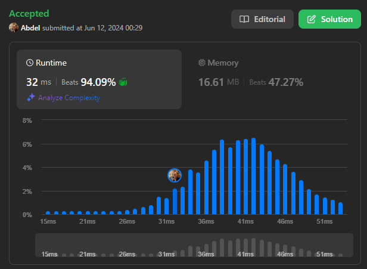

# 1122. Relative Sort Array

[View problem on LeetCode](https://leetcode.com/problems/relative-sort-array/)



Time complexity is $O(n \log n)$ where $n$ is the length of the `arr1` list.

```
Given two arrays arr1 and arr2, the elements of arr2 are distinct, and all elements in arr2 are also in arr1.

Sort the elements of arr1 such that the relative ordering of items in arr1 are the same as in arr2. Elements that do not appear in arr2 should be placed at the end of arr1 in ascending order.


Example 1:

Input: arr1 = [2,3,1,3,2,4,6,7,9,2,19], arr2 = [2,1,4,3,9,6]
Output: [2,2,2,1,4,3,3,9,6,7,19]


Example 2:

Input: arr1 = [28,6,22,8,44,17], arr2 = [22,28,8,6]
Output: [22,28,8,6,17,44]


Constraints:

1 <= arr1.length, arr2.length <= 1000
0 <= arr1[i], arr2[i] <= 1000
All the elements of arr2 are distinct.
Each arr2[i] is in arr1.
```
