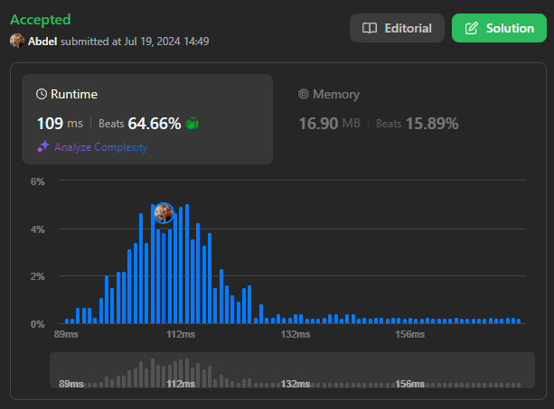

# 1380. Lucky Numbers in a Matrix

[View problem on LeetCode](https://leetcode.com/problems/lucky-numbers-in-a-matrix/)



Time Complexity: $O(m \cdot n)$ where $m$ is the number of rows and $n$ is the number of columns in the matrix.

```
Given an m x n matrix of distinct numbers, return all lucky numbers in the matrix in any order.

A lucky number is an element of the matrix such that it is the minimum element in its row and maximum in its column.


Example 1:

Input: matrix = [[3,7,8],[9,11,13],[15,16,17]]
Output: [15]
Explanation: 15 is the only lucky number since it is the minimum in its row and the maximum in its column.


Example 2:

Input: matrix = [[1,10,4,2],[9,3,8,7],[15,16,17,12]]
Output: [12]
Explanation: 12 is the only lucky number since it is the minimum in its row and the maximum in its column.


Example 3:

Input: matrix = [[7,8],[1,2]]
Output: [7]
Explanation: 7 is the only lucky number since it is the minimum in its row and the maximum in its column.


Constraints:

m == mat.length
n == mat[i].length
1 <= n, m <= 50
1 <= matrix[i][j] <= 10^5.
All elements in the matrix are distinct.
```
