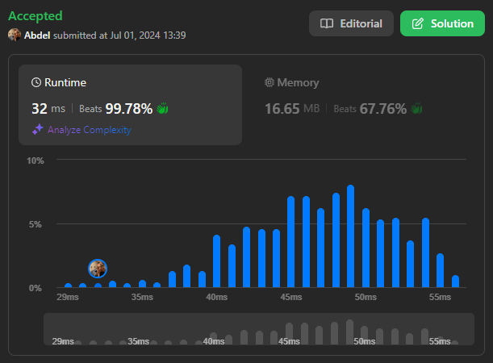

# 1550. Three Consecutive Odds

[View problem on LeetCode](https://leetcode.com/problems/three-consecutive-odds/)



Time complexity is $O(n)$ where $n$ is the length of the input array.

Space complexity is $O(1)$.

```
Given an integer array arr, return true if there are three consecutive odd numbers in the array. Otherwise, return false.


Example 1:

Input: arr = [2,6,4,1]
Output: false
Explanation: There are no three consecutive odds.


Example 2:

Input: arr = [1,2,34,3,4,5,7,23,12]
Output: true
Explanation: [5,7,23] are three consecutive odds.


Constraints:

1 <= arr.length <= 1000
1 <= arr[i] <= 1000
```
