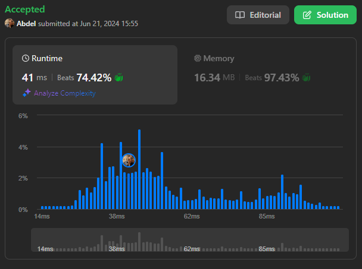

# 1863. Sum of All Subset XOR Totals

[View problem on LeetCode](https://leetcode.com/problems/sum-of-all-subset-xor-totals/)



To solve this problem, I used the recursive backtracking approach. The idea is to generate all possible subsets of the input list `nums` and calculate the XOR value for each subset. The sum of all XOR values for all subsets is then computed and returned as the final result.

```
The XOR total of an array is defined as the bitwise XOR of all its elements, or 0 if the array is empty.

For example, the XOR total of the array [2,5,6] is 2 XOR 5 XOR 6 = 1.
Given an array nums, return the sum of all XOR totals for every subset of nums.

Note: Subsets with the same elements should be counted multiple times.

An array a is a subset of an array b if a can be obtained from b by deleting some (possibly zero) elements of b.


Example 1:

Input: nums = [1,3]
Output: 6
Explanation: The 4 subsets of [1,3] are:
- The empty subset has an XOR total of 0.
- [1] has an XOR total of 1.
- [3] has an XOR total of 3.
- [1,3] has an XOR total of 1 XOR 3 = 2.
0 + 1 + 3 + 2 = 6
Example 2:

Input: nums = [5,1,6]
Output: 28
Explanation: The 8 subsets of [5,1,6] are:
- The empty subset has an XOR total of 0.
- [5] has an XOR total of 5.
- [1] has an XOR total of 1.
- [6] has an XOR total of 6.
- [5,1] has an XOR total of 5 XOR 1 = 4.
- [5,6] has an XOR total of 5 XOR 6 = 3.
- [1,6] has an XOR total of 1 XOR 6 = 7.
- [5,1,6] has an XOR total of 5 XOR 1 XOR 6 = 2.
0 + 5 + 1 + 6 + 4 + 3 + 7 + 2 = 28
Example 3:

Input: nums = [3,4,5,6,7,8]
Output: 480
Explanation: The sum of all XOR totals for every subset is 480.


Constraints:

1 <= nums.length <= 12
1 <= nums[i] <= 20
```

## Explanation of the Code written by ChatGPT:

### Initialization:

- `ans`: Variable to store the sum of XOR values of all subsets, initialized to 0.
- `n`: Length of the input list `nums`.

### Backtracking Approach:

- The function `backtrack` is defined within `subsetXORSum`. It recursively generates all subsets of `nums` and calculates the XOR of each subset.
  - `start`: Index to track the starting point of subset generation.
  - `xor`: XOR value computed for the current subset.

### Base Case and Recursive Execution:

- In `backtrack`, the base case occurs when `start` equals `n`, indicating that all elements have been considered for the current subset.
- For each subset starting from index `start`, iterate through the remaining elements of `nums`.
- Compute the XOR of the current subset by recursively calling `backtrack` with the next element (`i + 1`) and updated `xor` value (`xor ^ nums[i]`).

### Summing XOR Values:

- In each recursive call of `backtrack`, add the computed XOR value (`xor`) to `ans`.
- This accumulates the sum of XOR values for all subsets of `nums`.

### Initial Call:

- Start the recursive process by calling `backtrack(0, 0)`, indicating the subset generation starts from the first element of `nums` with an initial XOR value of 0.

### Return Result:

- After all recursive calls complete, `ans` contains the total sum of XOR values for all subsets of `nums`. Return `ans` as the final result.

This code uses a backtracking approach to generate all subsets, resulting in a time complexity of $O(2^n)$, where $n$ is the number of elements in `nums`. This is because there are $2^n$ subsets of any given set, and each subset operation (including XOR computation) takes constant time.
