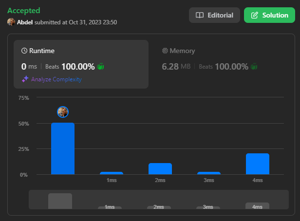

# 190. Reverse Bits

[View problem on LeetCode](https://leetcode.com/problems/reverse-bits/)



```
Reverse bits of a given 32 bits unsigned integer.

Note:

Note that in some languages, such as Java, there is no unsigned integer type. In this case, both input and output will be given as a signed integer type. They should not affect your implementation, as the integer's internal binary representation is the same, whether it is signed or unsigned.
In Java, the compiler represents the signed integers using 2's complement notation. Therefore, in Example 2 above, the input represents the signed integer -3 and the output represents the signed integer -1073741825.


Example 1:

Input: n = 00000010100101000001111010011100
Output:    964176192 (00111001011110000010100101000000)
Explanation: The input binary string 00000010100101000001111010011100 represents the unsigned integer 43261596, so return 964176192 which its binary representation is 00111001011110000010100101000000.


Example 2:

Input: n = 11111111111111111111111111111101
Output:   3221225471 (10111111111111111111111111111111)
Explanation: The input binary string 11111111111111111111111111111101 represents the unsigned integer 4294967293, so return 3221225471 which its binary representation is 10111111111111111111111111111111.


Constraints:

The input must be a binary string of length 32


Follow up: If this function is called many times, how would you optimize it?
```
