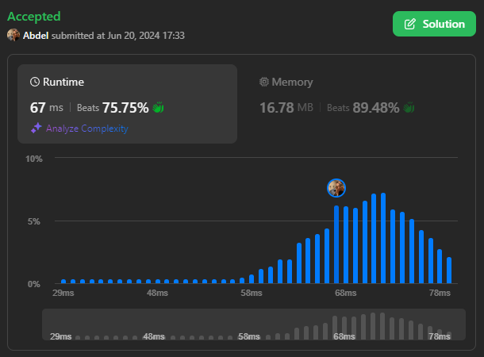

# 1929. Concatenation of Array

[View problem on LeetCode](https://leetcode.com/problems/concatenation-of-array/)



```
Given an integer array nums of length n, you want to create an array ans of length 2n where ans[i] == nums[i] and ans[i + n] == nums[i] for 0 <= i < n (0-indexed).

Specifically, ans is the concatenation of two nums arrays.

Return the array ans.


Example 1:

Input: nums = [1,2,1]
Output: [1,2,1,1,2,1]
Explanation: The array ans is formed as follows:
- ans = [nums[0],nums[1],nums[2],nums[0],nums[1],nums[2]]
- ans = [1,2,1,1,2,1]


Example 2:

Input: nums = [1,3,2,1]
Output: [1,3,2,1,1,3,2,1]
Explanation: The array ans is formed as follows:
- ans = [nums[0],nums[1],nums[2],nums[3],nums[0],nums[1],nums[2],nums[3]]
- ans = [1,3,2,1,1,3,2,1]


Constraints:

n == nums.length
1 <= n <= 1000
1 <= nums[i] <= 1000
```
