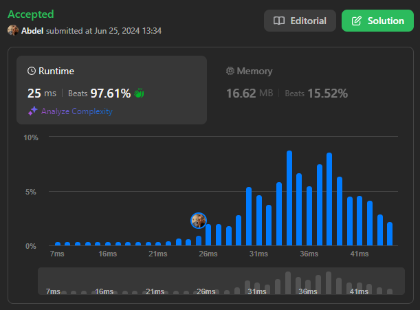

# 20. Valid Parentheses

[View problem on LeetCode](https://leetcode.com/problems/valid-parentheses/)

## C++ Solution


Time complexity is $O(n)$ where $n$ is the length of the string.

## Python3 Solution



Time complexity is $O(n)$ where $n$ is the length of the string.

```
Given a string s containing just the characters '(', ')', '{', '}', '[' and ']', determine if the input string is valid.

An input string is valid if:

Open brackets must be closed by the same type of brackets.
Open brackets must be closed in the correct order.
Every close bracket has a corresponding open bracket of the same type.


Example 1:

Input: s = "()"
Output: true
Example 2:

Input: s = "()[]{}"
Output: true
Example 3:

Input: s = "(]"
Output: false


Constraints:

1 <= s.length <= 10^4
s consists of parentheses only '()[]{}'.
```
