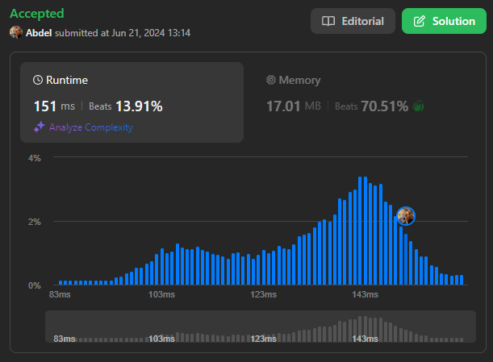

# 2373. Largest Local Values in a Matrix

[View problem on LeetCode](https://leetcode.com/problems/largest-local-values-in-a-matrix/)



Not the most efficient solution, but it works. I iterate through the matrix and for each 3x3 submatrix, I find the maximum value and add it to the result matrix.

```

You are given an n x n integer matrix grid.

Generate an integer matrix maxLocal of size (n - 2) x (n - 2) such that:

maxLocal[i][j] is equal to the largest value of the 3 x 3 matrix in grid centered around row i + 1 and column j + 1.
In other words, we want to find the largest value in every contiguous 3 x 3 matrix in grid.

Return the generated matrix.

Example 1:

Input: grid = [[9,9,8,1],[5,6,2,6],[8,2,6,4],[6,2,2,2]]
Output: [[9,9],[8,6]]
Explanation: The diagram above shows the original matrix and the generated matrix.
Notice that each value in the generated matrix corresponds to the largest value of a contiguous 3 x 3 matrix in grid.

Example 2:

Input: grid = [[1,1,1,1,1],[1,1,1,1,1],[1,1,2,1,1],[1,1,1,1,1],[1,1,1,1,1]]
Output: [[2,2,2],[2,2,2],[2,2,2]]
Explanation: Notice that the 2 is contained within every contiguous 3 x 3 matrix in grid.

Constraints:

n == grid.length == grid[i].length
3 <= n <= 100
1 <= grid[i][j] <= 100

```

```

```
