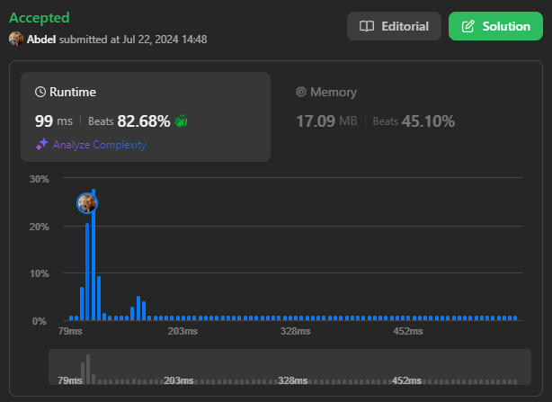

# 2418. Sort the People

[View problem on LeetCode](https://leetcode.com/problems/sort-the-people/)



Time Complexity: $O(n \log n)$ where $n$ is the length of the input array.

```
You are given an array of strings names, and an array heights that consists of distinct positive integers. Both arrays are of length n.

For each index i, names[i] and heights[i] denote the name and height of the ith person.

Return names sorted in descending order by the people's heights.


Example 1:

Input: names = ["Mary","John","Emma"], heights = [180,165,170]
Output: ["Mary","Emma","John"]
Explanation: Mary is the tallest, followed by Emma and John.


Example 2:

Input: names = ["Alice","Bob","Bob"], heights = [155,185,150]
Output: ["Bob","Alice","Bob"]
Explanation: The first Bob is the tallest, followed by Alice and the second Bob.


Constraints:

n == names.length == heights.length
1 <= n <= 10^3
1 <= names[i].length <= 20
1 <= heights[i] <= 10^5
names[i] consists of lower and upper case English letters.
All the values of heights are distinct.
```
