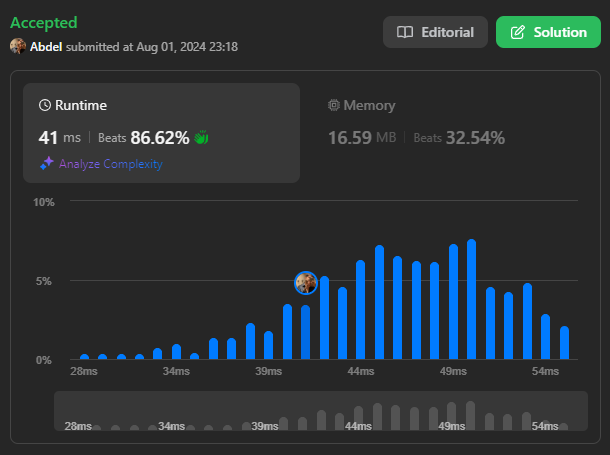

# 2678. Number of Senior Citizens

[View problem on LeetCode](https://leetcode.com/problems/number-of-senior-citizens/)



Time Complexity: $O(n)$ where $n$ is the number of passengers.

```
You are given a 0-indexed array of strings details. Each element of details provides information about a given passenger compressed into a string of length 15. The system is such that:

- The first ten characters consist of the phone number of passengers.
- The next character denotes the gender of the person.
- The following two characters are used to indicate the age of the person.
- The last two characters determine the seat allotted to that person.

Return the number of passengers who are strictly more than 60 years old.


Example 1:

Input: details = ["7868190130M7522","5303914400F9211","9273338290F4010"]
Output: 2
Explanation: The passengers at indices 0, 1, and 2 have ages 75, 92, and 40. Thus, there are 2 people who are over 60 years old.


Example 2:

Input: details = ["1313579440F2036","2921522980M5644"]
Output: 0
Explanation: None of the passengers are older than 60.


Constraints:

1 <= details.length <= 100
details[i].length == 15
details[i] consists of digits from '0' to '9'.
details[i][10] is either 'M' or 'F' or 'O'.
The phone numbers and seat numbers of the passengers are distinct.
```
