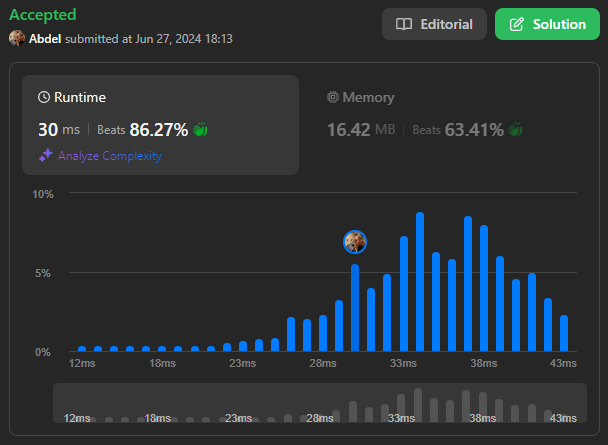

# 876. Middle of the Linked List

[View problem on leetcode](https://leetcode.com/problems/middle-of-the-linked-list/)



Just a simple problem where we need to find the middle of the linked list. We can solve this problem using the two-pointer technique. We will use two pointers, one slow and one fast. The slow pointer will move one step at a time, and the fast pointer will move two steps at a time. When the fast pointer reaches the end of the linked list, the slow pointer will be at the middle of the linked list.

Time Complexity: $O(N)$ where $N$ is the number of nodes in the linked list.

```
Given the head of a singly linked list, return the middle node of the linked list.

If there are two middle nodes, return the second middle node.


Example 1:

Input: head = [1,2,3,4,5]
Output: [3,4,5]
Explanation: The middle node of the list is node 3.


Example 2:

Input: head = [1,2,3,4,5,6]
Output: [4,5,6]
Explanation: Since the list has two middle nodes with values 3 and 4, we return the second one.


Constraints:

The number of nodes in the list is in the range [1, 100].
1 <= Node.val <= 100
```

## Example 1 Visualization


## Example 2 Visualization


