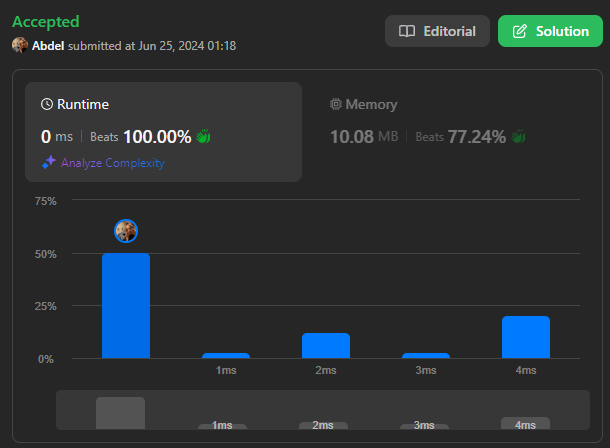
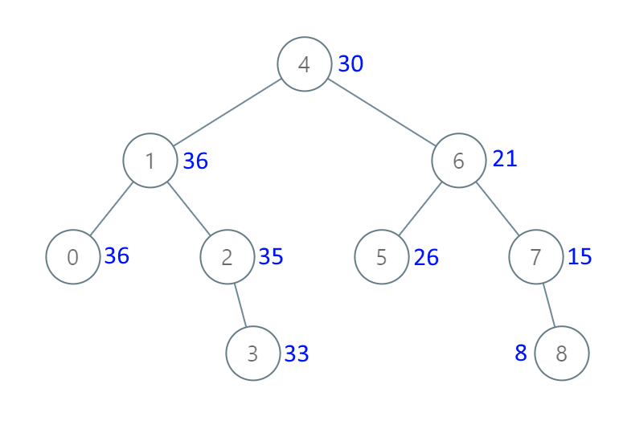

# 1038. Binary Search Tree to Greater Sum Tree

[View problem on LeetCode](https://leetcode.com/problems/binary-search-tree-to-greater-sum-tree/)



# Intuition

To convert a BST to a Greater Tree, I needed to ensure that each node's value is updated to include the sum of all nodes greater than it. Given the properties of BSTs, a reverse in-order traversal (right -> node -> left) allows me to accumulate values starting from the largest node and move towards the smallest node. This way, I could maintain a running sum of all processed nodes and update each node accordingly.

# Approach

I performed a reverse in-order traversal of the BST. During this traversal, I maintained a running sum that accumulates the values of all nodes visited so far. As I visit each node, I update its value to include this running sum and then continue the traversal. This ensures that each node's value reflects the sum of all nodes greater than itself in the original BST.

# Complexity

- Time complexity: $O(n)$, where $n$ is the number of nodes in the BST. This is because we visit each node exactly once during the traversal.

- Space complexity: $O(h)$, where $h$ is the height of the tree. This space is used by the recursion stack. In the worst case _(unbalanced tree)_, the height can be $O(n)$, but in the best case _(balanced tree)_, the height is $O(\log n)$.

```
Given the root of a Binary Search Tree (BST), convert it to a Greater Tree such that every key of the original BST is changed to the original key plus the sum of all keys greater than the original key in BST.

As a reminder, a binary search tree is a tree that satisfies these constraints:

The left subtree of a node contains only nodes with keys less than the node's key.
The right subtree of a node contains only nodes with keys greater than the node's key.
Both the left and right subtrees must also be binary search trees.


Example 1:

Input: root = [4,1,6,0,2,5,7,null,null,null,3,null,null,null,8]
Output: [30,36,21,36,35,26,15,null,null,null,33,null,null,null,8]


Example 2:

Input: root = [0,null,1]
Output: [1,null,1]


Constraints:

The number of nodes in the tree is in the range [1, 100].
0 <= Node.val <= 100
All the values in the tree are unique.


Note: This question is the same as 538: https://leetcode.com/problems/convert-bst-to-greater-tree/
```

## Example 1 Visualization



## Explanation of the Code written by ChatGPT:

### Initialization:

- `sum`: A class-level attribute to keep track of the accumulated sum during the traversal.

### Main Function:

- `bstToGst`: The main function that converts the BST to GST by performing a reverse in-order traversal (right -> root -> left).

### Reverse In-Order Traversal:

- **Base Case**:
  - If the current node `root` is `None`, return `root`.
- **Right Subtree Traversal**:
  - Recursively call `bstToGst` on the right child of the current node.
- **Update Current Node**:
  - Add the value of the current node `root.val` to the accumulated sum `self.sum`.
  - Update the current node's value to the new accumulated sum `self.sum`.
- **Left Subtree Traversal**:
  - Recursively call `bstToGst` on the left child of the current node.
- **Return Updated Root**:
  - Return the modified root node, which is now part of the GST.
