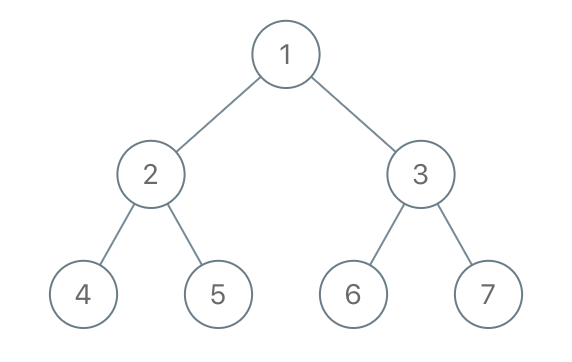

# 1110. Delete Nodes And Return Forest

[View problem on LeetCode](https://leetcode.com/problems/delete-nodes-and-return-forest/)


I turned the `to_delete` list into a hashset to turn the lookup into a $O(1)$ operation, then I used a recursive DFS to traverse the tree and delete the nodes that are in the `to_delete` set. I also added a check to see if the current node is in the `to_delete` set, if it is, I add the left and right children to the result list and return `null` to remove the current node from the tree.

Time Complexity: $O(N)$ where $N$ is the number of nodes in the tree.

```
Given the root of a binary tree, each node in the tree has a distinct value.

After deleting all nodes with a value in to_delete, we are left with a forest (a disjoint union of trees).

Return the roots of the trees in the remaining forest. You may return the result in any order.


Example 1:

Input: root = [1,2,3,4,5,6,7], to_delete = [3,5]
Output: [[1,2,null,4],[6],[7]]


Example 2:

Input: root = [1,2,4,null,3], to_delete = [3]
Output: [[1,2,4]]


Constraints:

The number of nodes in the given tree is at most 1000.
Each node has a distinct value between 1 and 1000.
to_delete.length <= 1000
to_delete contains distinct values between 1 and 1000.
```

## Example 1 Visualization


