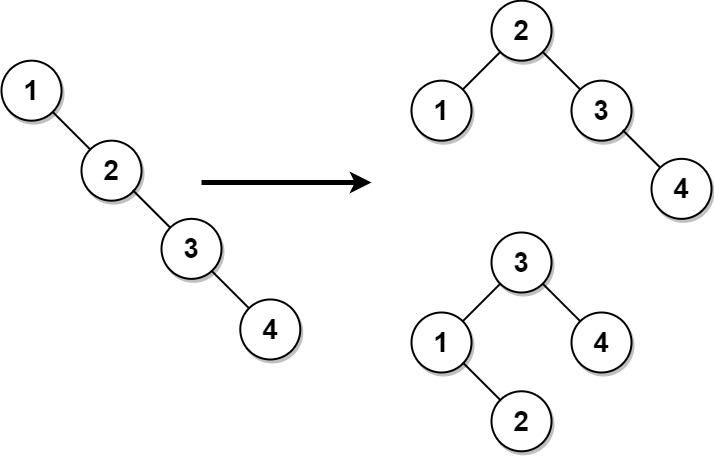

# 1382. Balance a Binary Search Tree

[View problem on LeetCode](https://leetcode.com/problems/balance-a-binary-search-tree/)


Time complexity is $O(N)$ where $N$ is the number of nodes in the tree. The space complexity is $O(N)$ as well.

```
Given the root of a binary search tree, return a balanced binary search tree with the same node values. If there is more than one answer, return any of them.

A binary search tree is balanced if the depth of the two subtrees of every node never differs by more than 1.


Example 1:

Input: root = [1,null,2,null,3,null,4,null,null]
Output: [2,1,3,null,null,null,4]
Explanation: This is not the only correct answer, [3,1,4,null,2] is also correct.


Example 2:

Input: root = [2,1,3]
Output: [2,1,3]


Constraints:

The number of nodes in the tree is in the range [1, 10^4].
1 <= Node.val <= 10^5
```

## Example 1 Visualization



## Explanation written by ChatGPT

1. **TreeNode Class (Commented Out)**:

   - The `TreeNode` class is the structure for each node in the BST, which includes a value (`val`), a left child (`left`), and a right child (`right`).

2. **Solution Class**:

   - The `Solution` class contains the method `balanceBST` which takes the root of a BST and returns a balanced BST.

3. **Variables**:

   - `nodes`: A list to store the nodes of the BST in in-order traversal.
   - `n`: An integer to count the number of nodes.

4. **storeBST Function**:

   - This function performs an in-order traversal of the BST and stores the nodes in the `nodes` list.
   - It also updates the count `n` of the nodes.

5. **buildTree Function**:

   - This function constructs a balanced BST from the `nodes` list.
   - It uses a recursive approach to build the tree. For a given range (`start` to `end`), it selects the middle element as the root and recursively builds the left and right subtrees.

6. **Execution Flow**:
   - First, the `storeBST` function is called to populate the `nodes` list.
   - Then, the `buildTree` function is called to construct and return the balanced BST.

### How it Works:

- **In-order Traversal**: The `storeBST` function ensures that the nodes are stored in sorted order because in-order traversal of a BST yields sorted values.
- **Balanced Tree Construction**: The `buildTree` function takes advantage of the sorted nodes to build a balanced tree by always choosing the middle element as the root, ensuring that the left and right subtrees are balanced.
