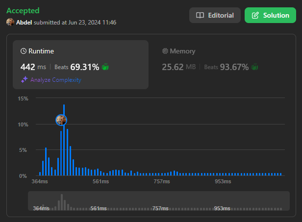

# 1438. Longest Continuous Subarray With Absolute Diff Less Than or Equal to Limit

[View problem on Leetcode](https://leetcode.com/problems/longest-continuous-subarray-with-absolute-diff-less-than-or-equal-to-limit/)



Well, this is definitely not a medium problem...
I think the key to this problem is to use a monotonic queue to keep track of the maximum and minimum values in the current sliding window.

I used the sliding window approach to solve this problem. I used two pointers, left and right, to keep track of the current window. I also used a deque to keep track of the maximum and minimum values in the current window.

```
Given an array of integers nums and an integer limit, return the size of the longest non-empty subarray such that the absolute difference between any two elements of this subarray is less than or equal to limit.

Example 1:

Input: nums = [8,2,4,7], limit = 4
Output: 2
Explanation: All subarrays are:
[8] with maximum absolute diff |8-8| = 0 <= 4.
[8,2] with maximum absolute diff |8-2| = 6 > 4.
[8,2,4] with maximum absolute diff |8-2| = 6 > 4.
[8,2,4,7] with maximum absolute diff |8-2| = 6 > 4.
[2] with maximum absolute diff |2-2| = 0 <= 4.
[2,4] with maximum absolute diff |2-4| = 2 <= 4.
[2,4,7] with maximum absolute diff |2-7| = 5 > 4.
[4] with maximum absolute diff |4-4| = 0 <= 4.
[4,7] with maximum absolute diff |4-7| = 3 <= 4.
[7] with maximum absolute diff |7-7| = 0 <= 4.
Therefore, the size of the longest subarray is 2.
Example 2:

Input: nums = [10,1,2,4,7,2], limit = 5
Output: 4
Explanation: The subarray [2,4,7,2] is the longest since the maximum absolute diff is |2-7| = 5 <= 5.
Example 3:

Input: nums = [4,2,2,2,4,4,2,2], limit = 0
Output: 3
```

## Explanation of the Code written by ChatGPT:

### Initialization:

- `n`: Length of the input array `nums`.
- `max_deque`, `min_deque`: Two deques to store indices of elements for maintaining the maximum and minimum values in the current window.
- `left`: Pointer for the left end of the sliding window, initialized to 0.
- `longest`: Variable to store the length of the longest subarray found, initialized to 0.

### Sliding Window Technique:

- The `for` loop iterates through each element in `nums`, using `right` as the right pointer of the sliding window.

### Maintaining Maximum and Minimum Deques:

- Inside the loop, elements are added to `max_deque` and `min_deque` to maintain indices of elements in descending and ascending order of their values, respectively.
  - `max_deque` keeps indices of elements in descending order of `nums` values to quickly find the maximum element in the current window.
  - `min_deque` keeps indices of elements in ascending order of `nums` values to quickly find the minimum element in the current window.

### Adjusting the Window:

- After adding the current element's index to `max_deque` and `min_deque`, a `while` loop adjusts the window to ensure the absolute difference between the maximum and minimum elements in the window is less than or equal to `limit`.
  - If the difference exceeds `limit`, increment the `left` pointer to shrink the window until the condition is satisfied. This involves removing elements from the left end of `max_deque` and `min_deque` if they are out of the current window range.

### Calculating the Length of the Longest Subarray:

- After adjusting the window, calculate the length of the current valid subarray (`right - left + 1`) and update `longest` if this length is greater than the previously recorded longest subarray length.

### Return Result:

- Finally, `longest` contains the length of the longest subarray found where the absolute difference between any two elements is less than or equal to `limit`. Return `longest` as the result.

This code efficiently finds the longest subarray meeting the given condition using a sliding window approach with two deques to track maximum and minimum values, achieving a time complexity of $O(n)$.
