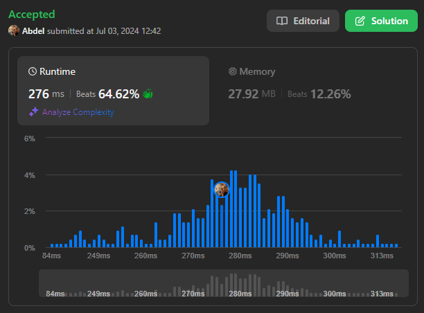

# 1509. Minimum Difference Between Largest and Smallest Value in Three Moves

[View problem on LeetCode](https://leetcode.com/problems/minimum-difference-between-largest-and-smallest-value-in-three-moves/)



I solved this problem by sorting the array and then trying all possible combinations of removing 3 elements from the start and 3 elements from the end of the array. I then calculated the difference between the maximum and minimum values of the remaining elements and returned the minimum difference.

If the array has less than 5 elements, I directly return 0 because the difference between the maximum and minimum values of an array with less than 5 elements is always 0.

The time complexity of this solution is $O(n \log n)$ because of the sorting step. The space complexity is $O(1)$ because I am not using any extra space.

**Note:**
I know that there is a better solution for this problem. I will try to solve it using a better approach in the future using the **Heap Queue** data structure, where the time complexity will be $O(n)$.

```
You are given an integer array nums.

In one move, you can choose one element of nums and change it to any value.

Return the minimum difference between the largest and smallest value of nums after performing at most three moves.


Example 1:

Input: nums = [5,3,2,4]
Output: 0
Explanation: We can make at most 3 moves.
In the first move, change 2 to 3. nums becomes [5,3,3,4].
In the second move, change 4 to 3. nums becomes [5,3,3,3].
In the third move, change 5 to 3. nums becomes [3,3,3,3].
After performing 3 moves, the difference between the minimum and maximum is 3 - 3 = 0.


Example 2:

Input: nums = [1,5,0,10,14]
Output: 1
Explanation: We can make at most 3 moves.
In the first move, change 5 to 0. nums becomes [1,0,0,10,14].
In the second move, change 10 to 0. nums becomes [1,0,0,0,14].
In the third move, change 14 to 1. nums becomes [1,0,0,0,1].
After performing 3 moves, the difference between the minimum and maximum is 1 - 0 = 1.
It can be shown that there is no way to make the difference 0 in 3 moves.


Example 3:

Input: nums = [3,100,20]
Output: 0
Explanation: We can make at most 3 moves.
In the first move, change 100 to 7. nums becomes [3,7,20].
In the second move, change 20 to 7. nums becomes [3,7,7].
In the third move, change 3 to 7. nums becomes [7,7,7].
After performing 3 moves, the difference between the minimum and maximum is 7 - 7 = 0.


Constraints:

1 <= nums.length <= 10^5
-10^9 <= nums[i] <= 10^9
```
