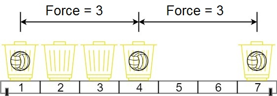

# 1552. Magnetic Force Between Two Balls

[View problem on LeetCode](https://leetcode.com/problems/magnetic-force-between-two-balls/)


I used a binary search approach to solve this problem. I first sorted the positions of the baskets.

I then calculated the minimum and maximum possible magnetic force between two balls. I used binary search to find the maximum magnetic force that satisfies the condition.

I checked if the mid value satisfies the condition by iterating through the positions of the baskets and checking if the distance between the current basket and the previous basket is greater than or equal to the mid value.

If it is, I increment the count of balls placed and update the previous basket position. If the count of balls placed is equal to the total number of balls, I return true.

If the count of balls placed is less than the total number of balls, I return false. I then update the minimum and maximum values based on the result of the binary search.

I return the minimum value as the final result.

Time complexity is $O(n \log max\_distance)$, where $n$ is the number of positions and $max\_distance$ is the difference between the maximum and minimum positions in the sorted list.

```
In the universe Earth C-137, Rick discovered a special form of magnetic force between two balls if they are put in his new invented basket. Rick has n empty baskets, the ith basket is at position[i], Morty has m balls and needs to distribute the balls into the baskets such that the minimum magnetic force between any two balls is maximum.

Rick stated that magnetic force between two different balls at positions x and y is |x - y|.

Given the integer array position and the integer m. Return the required force.


Example 1:

Input: position = [1,2,3,4,7], m = 3
Output: 3
Explanation: Distributing the 3 balls into baskets 1, 4 and 7 will make the magnetic force between ball pairs [3, 3, 6]. The minimum magnetic force is 3. We cannot achieve a larger minimum magnetic force than 3.


Example 2:

Input: position = [5,4,3,2,1,1000000000], m = 2
Output: 999999999
Explanation: We can use baskets 1 and 1000000000.


Constraints:

n == position.length
2 <= n <= 10^5
1 <= position[i] <= 10^9
All integers in position are distinct.
2 <= m <= position.length
```

## Example 1 Visualization



## Explanation of the Code written by ChatGPT:

### Initialization:

- `n`: Length of the input list `position`.
- `position.sort()`: Sort the positions to facilitate distance calculation.
- `low`, `high`: Variables for the binary search range. `low` is initialized to 1 (minimum possible distance), and `high` is initialized to the difference between the last and first elements in the sorted list (maximum possible distance).
- `best`: Variable to store the best (maximum minimum) distance found, initialized to 0.

### Binary Search for Maximum Minimum Distance:

- Use binary search to determine the largest minimum distance where `m` balls can be placed.

### Helper Function `able`:

- `able(minimum)`: Checks if it is possible to place m balls such that the minimum distance between any two balls is at least `minimum`.
  - Initialize `count` to 1 (placing the first ball at the first position) and `last_position` to `position[0]`.
  - Iterate through the positions starting from the second position.
  - If the distance between the current position and `last_position` is greater than or equal to `minimum`, increment the `count` and update `last_position` to the current position.
  - If `count` reaches `m`, return `True` (indicating that placing m balls with at least `minimum` distance is possible).
  - If the loop completes without placing `m` balls, return `False`.

### Binary Search Execution:

- `while low <= high`: Continue the binary search until `low` exceeds `high`.
  - Calculate `mid` as the average of `low` and `high`.
  - If `able(mid)` returns `True`, update `best` to `mid` and set `low` to `mid + 1` (to check for a larger possible minimum distance).
  - If `able(mid)` returns `False`, set `high` to `mid - 1` (to check for a smaller possible minimum distance).

### Return Result:

- After the binary search completes, `best` contains the maximum minimum distance that allows placing `m` balls. Return `best` as the final result.
