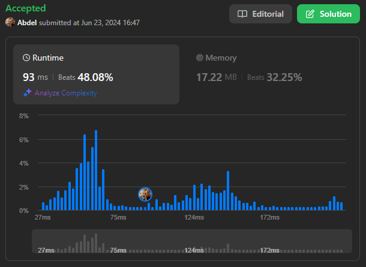

# 1689. Partitioning Into Minimum Number Of Deci-Binary Numbers

[View problem on LeetCode](https://leetcode.com/problems/partitioning-into-minimum-number-of-deci-binary-numbers/)



Time Complexity: $O(n)$

- Think about if the input was only one digit. Then you need to add up as many ones as the value of this digit.

- If the input has multiple digits, then you can solve for each digit independently, and merge the answers to form numbers that add up to that input.

- Thus, the answer is equal to the maximum digit in the input.

```
A decimal number is called deci-binary if each of its digits is either 0 or 1 without any leading zeros. For example, 101 and 1100 are deci-binary, while 112 and 3001 are not.

Given a string n that represents a positive decimal integer, return the minimum number of positive deci-binary numbers needed so that they sum up to n.


Example 1:

Input: n = "32"
Output: 3
Explanation: 10 + 11 + 11 = 32
Example 2:

Input: n = "82734"
Output: 8
Example 3:

Input: n = "27346209830709182346"
Output: 9


Constraints:

1 <= n.length <= 10^5
n consists of only digits.
n does not contain any leading zeros and represents a positive integer.
```
