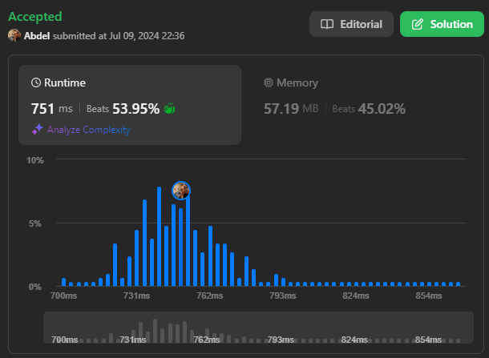

# 1701. Average Waiting Time

[View problem on LeetCode](https://leetcode.com/problems/average-waiting-time/)



Time complexity: $O(n)$ where $n$ is the number of customers.

```
There is a restaurant with a single chef. You are given an array customers, where customers[i] = [arrivali, timei]:

arrivali is the arrival time of the ith customer. The arrival times are sorted in non-decreasing order.
timei is the time needed to prepare the order of the ith customer.
When a customer arrives, he gives the chef his order, and the chef starts preparing it once he is idle. The customer waits till the chef finishes preparing his order. The chef does not prepare food for more than one customer at a time. The chef prepares food for customers in the order they were given in the input.

Return the average waiting time of all customers. Solutions within 10-5 from the actual answer are considered accepted.


Example 1:

Input: customers = [[1,2],[2,5],[4,3]]
Output: 5.00000
Explanation:
1) The first customer arrives at time 1, the chef takes his order and starts preparing it immediately at time 1, and finishes at time 3, so the waiting time of the first customer is 3 - 1 = 2.
2) The second customer arrives at time 2, the chef takes his order and starts preparing it at time 3, and finishes at time 8, so the waiting time of the second customer is 8 - 2 = 6.
3) The third customer arrives at time 4, the chef takes his order and starts preparing it at time 8, and finishes at time 11, so the waiting time of the third customer is 11 - 4 = 7.
So the average waiting time = (2 + 6 + 7) / 3 = 5.


Example 2:

Input: customers = [[5,2],[5,4],[10,3],[20,1]]
Output: 3.25000
Explanation:
1) The first customer arrives at time 5, the chef takes his order and starts preparing it immediately at time 5, and finishes at time 7, so the waiting time of the first customer is 7 - 5 = 2.
2) The second customer arrives at time 5, the chef takes his order and starts preparing it at time 7, and finishes at time 11, so the waiting time of the second customer is 11 - 5 = 6.
3) The third customer arrives at time 10, the chef takes his order and starts preparing it at time 11, and finishes at time 14, so the waiting time of the third customer is 14 - 10 = 4.
4) The fourth customer arrives at time 20, the chef takes his order and starts preparing it immediately at time 20, and finishes at time 21, so the waiting time of the fourth customer is 21 - 20 = 1.
So the average waiting time = (2 + 6 + 4 + 1) / 4 = 3.25.


Constraints:

1 <= customers.length <= 10^5
1 <= arrivali, timei <= 10^4
arrival(i) <= arrival(i+1)
```
