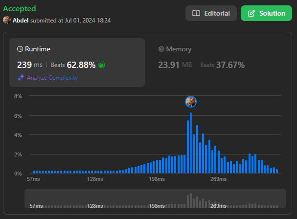

# 200. Number of Islands

[View problem on LeetCode](https://leetcode.com/problems/number-of-islands/)



I used a breadth-first search to solve this problem. I iterated through the grid and when I found a 1 (island), I incremented the count of islands and called the bfs function. The bfs function iterated through the grid in all vertical and horizontal directions from the current cell and set all connected islands as visited. This way, I would not count the same island twice.

Time complexity is $O(m \cdot n)$ where $m$ is the number of rows and $n$ is the number of columns in the grid.

Space complexity is $O(m \cdot n)$ as well because of the visited array.

_**Note:** I could have used the grid itself as the visited array to save space but that would have modified the input which is not recommended._

```
Given an m x n 2D binary grid grid which represents a map of '1's (land) and '0's (water), return the number of islands.

An island is surrounded by water and is formed by connecting adjacent lands horizontally or vertically. You may assume all four edges of the grid are all surrounded by water.


Example 1:

Input: grid = [
  ["1","1","1","1","0"],
  ["1","1","0","1","0"],
  ["1","1","0","0","0"],
  ["0","0","0","0","0"]
]
Output: 1


Example 2:

Input: grid = [
  ["1","1","0","0","0"],
  ["1","1","0","0","0"],
  ["0","0","1","0","0"],
  ["0","0","0","1","1"]
]
Output: 3


Constraints:

m == grid.length
n == grid[i].length
1 <= m, n <= 300
grid[i][j] is '0' or '1'.
```
