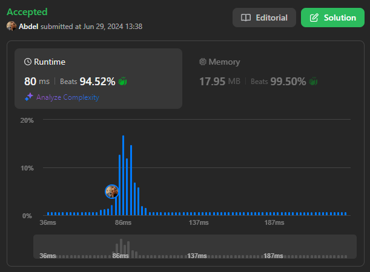

# 207. Course Schedule

[View problem on LeetCode](https://leetcode.com/problems/course-schedule/)



I have solved this problem using a topological sort algorithm. Similar to [2192. All Ancestors of a Node in a Directed Acyclic Graph](/II.%20MEDIUM/2192.%20All%20Ancestors%20of%20a%20Node%20in%20a%20Directed%20Acyclic%20Graph/), I have used a depth-first search (DFS) algorithm to traverse the graph and detect cycles.

Time complexity is $O(V + E)$ where $V$ is the number of vertices and $E$ is the number of edges in the graph.

```
There are a total of numCourses courses you have to take, labeled from 0 to numCourses - 1. You are given an array prerequisites where prerequisites[i] = [ai, bi] indicates that you must take course bi first if you want to take course ai.

For example, the pair [0, 1], indicates that to take course 0 you have to first take course 1.
Return true if you can finish all courses. Otherwise, return false.


Example 1:

Input: numCourses = 2, prerequisites = [[1,0]]
Output: true
Explanation: There are a total of 2 courses to take.
To take course 1 you should have finished course 0. So it is possible.


Example 2:

Input: numCourses = 2, prerequisites = [[1,0],[0,1]]
Output: false
Explanation: There are a total of 2 courses to take.
To take course 1 you should have finished course 0, and to take course 0 you should also have finished course 1. So it is impossible.


Constraints:

1 <= numCourses <= 2000
0 <= prerequisites.length <= 5000
prerequisites[i].length == 2
0 <= ai, bi < numCourses
All the pairs prerequisites[i] are unique.
```
