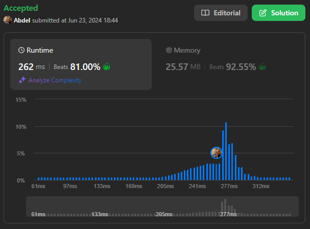

# 238. Product of Array Except Self

[View problem on LeetCode](https://leetcode.com/problems/product-of-array-except-self/)



What makes this problem interesting is that it asks for a solution that runs in $O(n)$ time and without using the division operation. This means that we can't simply multiply all the elements of the array and then divide by the element at index `i` to get the answer at index `i`. We need to come up with a different approach.

Also what makes it more interesting is the follow-up question that asks if we can solve the problem in $O(1)$ extra space complexity. This means that we can't use an extra array to store the prefix products and another array to store the suffix products. We need to come up with a solution that uses only the output array to store the results.

I used a two-pass approach to solve this problem. In the first pass, I calculated the prefix products and stored them in the output array. In the second pass, I calculated the suffix products and multiplied them with the prefix products stored in the output array to get the final result.

See the code explanation below for more details.

Time complexity is $O(n)$ and space complexity is $O(1)$ excluding the output array.

```
Given an integer array nums, return an array answer such that answer[i] is equal to the product of all the elements of nums except nums[i].

The product of any prefix or suffix of nums is guaranteed to fit in a 32-bit integer.

You must write an algorithm that runs in O(n) time and without using the division operation.


Example 1:

Input: nums = [1,2,3,4]
Output: [24,12,8,6]


Example 2:

Input: nums = [-1,1,0,-3,3]
Output: [0,0,9,0,0]


Constraints:

2 <= nums.length <= 105
-30 <= nums[i] <= 30
The product of any prefix or suffix of nums is guaranteed to fit in a 32-bit integer.


Follow up: Can you solve the problem in O(1) extra space complexity? (The output array does not count as extra space for space complexity analysis.)
```

## Explanation of the Code written by ChatGPT:

### Initialization:

- `n`: The length of the `nums` list.
- `answer`: A list initialized to 1 for each element, to store the result.
- `product`: A variable used to keep track of the cumulative product during iterations, initialized to 1.

### First Pass (Left to Right):

- Iterate through the `nums` list from left to right:
  - Set `answer[i]` to `product` (which represents the product of all elements to the left of `i`).
  - Update `product` by multiplying it with `nums[i]` to include the current element in the product for the next iteration.

### Second Pass (Right to Left):

- Reset `product` to 1.
- Iterate through the `nums` list from right to left:
  - Multiply `answer[i]` by `product` (which now represents the product of all elements to the right of `i`).
  - Update `product` by multiplying it with `nums[i]` to include the current element in the product for the next iteration.

### Return Result:

- After completing both passes, `answer` contains the product of all elements except `nums[i]` for each index `i`. Return `answer` as the final result.
