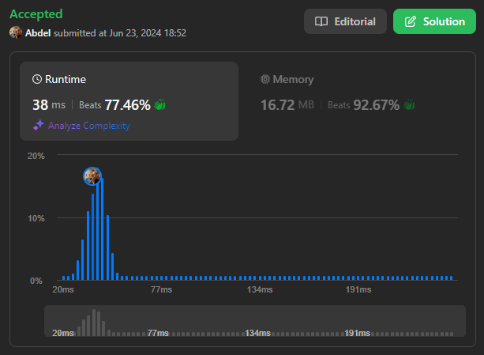

# 274. H-Index

[View problem on LeetCode](https://leetcode.com/problems/h-index/)



Time complexity is $O(n \log n)$ where $n$ is the length of the `citations` list.

```
Given an array of integers citations where citations[i] is the number of citations a researcher received for their ith paper, return the researcher's h-index.

According to the definition of h-index on Wikipedia: The h-index is defined as the maximum value of h such that the given researcher has published at least h papers that have each been cited at least h times.


Example 1:

Input: citations = [3,0,6,1,5]
Output: 3
Explanation: [3,0,6,1,5] means the researcher has 5 papers in total and each of them had received 3, 0, 6, 1, 5 citations respectively.
Since the researcher has 3 papers with at least 3 citations each and the remaining two with no more than 3 citations each, their h-index is 3.


Example 2:

Input: citations = [1,3,1]
Output: 1


Constraints:

n == citations.length
1 <= n <= 5000
0 <= citations[i] <= 1000
```
