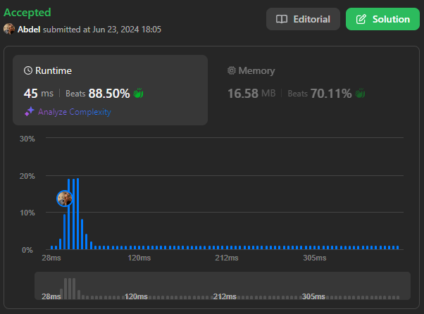

# 39. Combination Sum

[View problem on LeetCode](https://leetcode.com/problems/combination-sum/)



Time complexity is $O(n \log n)$ for sorting the candidates and $O(2^n)$ for generating all possible combinations.

```
Given an array of distinct integers candidates and a target integer target, return a list of all unique combinations of candidates where the chosen numbers sum to target. You may return the combinations in any order.

The same number may be chosen from candidates an unlimited number of times. Two combinations are unique if the
frequency
 of at least one of the chosen numbers is different.

The test cases are generated such that the number of unique combinations that sum up to target is less than 150 combinations for the given input.


Example 1:

Input: candidates = [2,3,6,7], target = 7
Output: [[2,2,3],[7]]
Explanation:
2 and 3 are candidates, and 2 + 2 + 3 = 7. Note that 2 can be used multiple times.
7 is a candidate, and 7 = 7.
These are the only two combinations.


Example 2:

Input: candidates = [2,3,5], target = 8
Output: [[2,2,2,2],[2,3,3],[3,5]]


Example 3:

Input: candidates = [2], target = 1
Output: []


Constraints:

1 <= candidates.length <= 30
2 <= candidates[i] <= 40
All elements of candidates are distinct.
1 <= target <= 40
```

## Explanation of the Code written by ChatGPT:

### Problem Understanding:

The goal is to find all unique combinations of candidates where the candidate numbers sum to the given target. Each number in `candidates` can be used an unlimited number of times.

### Initialization:

- `candidates.sort()`: Sort the candidates to facilitate early termination in the backtracking process.
- `ans`: A list to store the valid combinations that sum to the target.

### Backtracking Approach:

- The function `backtrack` is defined within `combinationSum`. It recursively explores potential combinations.
  - `start`: The starting index for the current recursive call to prevent reusing elements from earlier indices.
  - `current`: A list to store the current combination of numbers being considered.
  - `remaining_target`: The remaining sum needed to reach the target.

### Base Case and Recursive Execution:

- In `backtrack`, if `remaining_target` is 0, it means the current combination sums to the target. Append a copy of `current` to `ans` and return.
- Iterate through the `candidates` starting from the index `start` to `n` (length of `candidates`).
- If the current candidate `candidates[i]` is greater than `remaining_target`, break the loop as further candidates will also be greater (due to sorting).
- Append `candidates[i]` to `current` and recursively call `backtrack` with the updated index `i` (allowing the same element to be reused) and the reduced `remaining_target`.
- After the recursive call, remove the last element from `current` to backtrack and try the next candidate.

### Initial Call:

- Start the recursive process by calling `backtrack(0, [], target)`, indicating the subset generation starts from the first candidate with an initial empty combination and the full target.

### Return Result:

- After all recursive calls complete, `ans` contains all unique combinations that sum to the target. Return `ans` as the final result.
