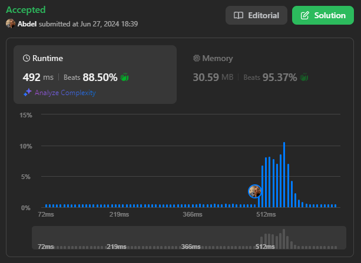

# 53. Maximum Subarray

[View problem on leetcode](https://leetcode.com/problems/maximum-subarray/)



In this problem, I directly implemented the Kadane's algorithm to solve the problem. The algorithm is very simple and easy to understand. The algorithm is as follows:

### Kadane's Algorithm Pseudocode

```
Initialize:
    max_so_far = INT_MIN
    max_ending_here = 0

Loop for each element of the array:
  (a) max_ending_here = max_ending_here + a[i]
  (b) if(max_so_far < max_ending_here)
            max_so_far = max_ending_here
  (c) if(max_ending_here < 0)
            max_ending_here = 0

return max_so_far
```

Time Complexity: $O(n)$ where $n$ is the size of the input array.

Space Complexity: $O(1)$

### Illustration of the Algorithm


```
Given an integer array nums, find the subarray with the largest sum, and return its sum.


Example 1:

Input: nums = [-2,1,-3,4,-1,2,1,-5,4]
Output: 6
Explanation: The subarray [4,-1,2,1] has the largest sum 6.


Example 2:

Input: nums = [1]
Output: 1
Explanation: The subarray [1] has the largest sum 1.


Example 3:

Input: nums = [5,4,-1,7,8]
Output: 23
Explanation: The subarray [5,4,-1,7,8] has the largest sum 23.


Constraints:

1 <= nums.length <= 10^5
-10^4 <= nums[i] <= 10^4
```
