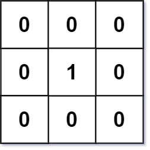

# 542. 01 Matrix

[View problem on leetcode](https://leetcode.com/problems/01-matrix/)


I used a breadth-first search to solve this problem. I first loop through the matrix and add all the 0s to a queue. Then I loop through the queue and add all the neighbors of the 0s to the queue. I keep track of the distance of each cell from the nearest 0. I return the new distance matrix after all the cells have been visited.

Time complexity is $O(m \cdot n)$ where $m$ is the number of rows and $n$ is the number of columns in the matrix.

Space complexity is $O(m \cdot n)$.

```
Given an m x n binary matrix mat, return the distance of the nearest 0 for each cell.

The distance between two adjacent cells is 1.


Example 1:

Input: mat = [[0,0,0],[0,1,0],[0,0,0]]
Output: [[0,0,0],[0,1,0],[0,0,0]]


Example 2:

Input: mat = [[0,0,0],[0,1,0],[1,1,1]]
Output: [[0,0,0],[0,1,0],[1,2,1]]


Constraints:

m == mat.length
n == mat[i].length
1 <= m, n <= 10^4
1 <= m * n <= 10^4
mat[i][j] is either 0 or 1.
There is at least one 0 in mat.
```

## Example 1 Visualization


