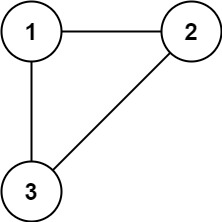
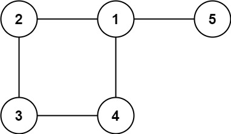

# 684. Redundant Connection

[View problem on LeetCode](https://leetcode.com/problems/redundant-connection/)


I had to learn about the **Union-Find algorithm** to solve this problem. It is used to detect cycles in a graph and is based on the concept of disjoint sets.

Initially, all nodes are their own parent. When we find an edge between two nodes, we check if they have the same parent. If they do, then there is a cycle. If they don't, we set the parent of one node to the other. This way, we can detect cycles in a graph.

Time complexity is $O(n)$ where $n$ is the number of edges. We iterate through all edges once thanks to the **Union-Find algorithm**.

```
In this problem, a tree is an undirected graph that is connected and has no cycles.

You are given a graph that started as a tree with n nodes labeled from 1 to n, with one additional edge added. The added edge has two different vertices chosen from 1 to n, and was not an edge that already existed. The graph is represented as an array edges of length n where edges[i] = [ai, bi] indicates that there is an edge between nodes ai and bi in the graph.

Return an edge that can be removed so that the resulting graph is a tree of n nodes. If there are multiple answers, return the answer that occurs last in the input.


Example 1:

Input: edges = [[1,2],[1,3],[2,3]]
Output: [2,3]


Example 2:

Input: edges = [[1,2],[2,3],[3,4],[1,4],[1,5]]
Output: [1,4]


Constraints:

n == edges.length
3 <= n <= 1000
edges[i].length == 2
1 <= ai < bi <= edges.length
ai != bi
There are no repeated edges.
The given graph is connected.
```

## Example 1 Visualization



## Example 2 Visualization


