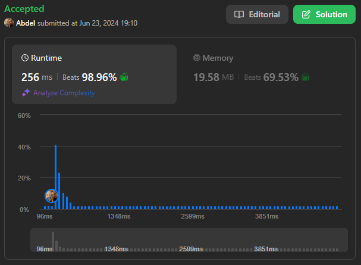

# 826. Most Profit Assigning Work

[View problem on LeetCode](https://leetcode.com/problems/most-profit-assigning-work/)



Time complexity is $O(n \log n)$ where $n$ is the length of the `difficulty` list.

Time complexity is $O(n \log n + w \log w)$ where $n$ is the number of jobs and $w$ is the number of workers:

- The algorithm sorts the jobs and workers, which takes $O(n \log n + w \log w)$ time where `n` is the number of jobs and `w` is the number of workers.
- The iteration through the workers and jobs runs in $O(n + w)$ time.
- Overall, the time complexity is dominated by the sorting step, making it $O(n \log n + w \log w)$.

```
You have n jobs and m workers. You are given three arrays: difficulty, profit, and worker where:

difficulty[i] and profit[i] are the difficulty and the profit of the ith job, and
worker[j] is the ability of jth worker (i.e., the jth worker can only complete a job with difficulty at most worker[j]).
Every worker can be assigned at most one job, but one job can be completed multiple times.

For example, if three workers attempt the same job that pays $1, then the total profit will be $3. If a worker cannot complete any job, their profit is $0.
Return the maximum profit we can achieve after assigning the workers to the jobs.


Example 1:

Input: difficulty = [2,4,6,8,10], profit = [10,20,30,40,50], worker = [4,5,6,7]
Output: 100
Explanation: Workers are assigned jobs of difficulty [4,4,6,6] and they get a profit of [20,20,30,30] separately.


Example 2:

Input: difficulty = [85,47,57], profit = [24,66,99], worker = [40,25,25]
Output: 0


Constraints:

n == difficulty.length
n == profit.length
m == worker.length
1 <= n, m <= 10^4
1 <= difficulty[i], profit[i], worker[i] <= 10^5
```

## Explanation of the Code written by ChatGPT:

### Sorting Jobs and Workers:

- `jobs`: A list of tuples where each tuple is (difficulty, profit). This list is sorted by difficulty and, if difficulties are equal, by profit.
- `worker`: The list of workers' abilities, sorted in non-decreasing order.

### Initialization:

- `n`: The number of jobs.
- `max_profit`: To keep track of the total maximum profit.
- `max_profit_so_far`: To store the maximum profit available for the current job's difficulty.
- `job_index`: To iterate through the `jobs` list.

### Iterating Over Workers:

- For each worker's `ability`:
  - While there are jobs left and the current job's difficulty is less than or equal to the worker's ability:
    - Update `max_profit_so_far` to the maximum profit of the jobs that the worker can complete.
    - Move to the next job by incrementing `job_index`.
  - Add `max_profit_so_far` to `max_profit` since this is the best job the worker can do.

### Return Result:

- After iterating through all workers, `max_profit` will contain the total maximum profit achievable. Return `max_profit` as the final result.
