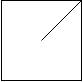

# 959. Regions Cut By Slashes

[View problem on LeetCode](https://leetcode.com/problems/regions-cut-by-slashes/)


As a start, I translated the grid into a 2D array of integers representing the pixels. Each character in the grid is translated into a 3x3 matrix of integers. The matrix is filled with 1s and 0s, where 1s represent the pixels that are part of the region and 0s represent the pixels that are not part of the region.

The next step is to iterate through the 2D array and count the number of regions. The regions are identified by the 1s in the 2D array. The regions are counted by performing a depth-first search (DFS) on the 2D array.

For the counting of regions, you can solve the [Number of Islands](/II.%20MEDIUM/200.%20Number%20of%20Islands/) problem first to get a better understanding of how to count the number of regions in a 2D array.

```
An n x n grid is composed of 1 x 1 squares where each 1 x 1 square consists of a '/', '\', or blank space ' '. These characters divide the square into contiguous regions.

Given the grid grid represented as a string array, return the number of regions.

Note that backslash characters are escaped, so a '\' is represented as '\\'.


Example 1:

Input: grid = [" /","/ "]
Output: 2


Example 2:

Input: grid = [" /","  "]
Output: 1


Example 3:

Input: grid = ["/\\","\\/"]
Output: 5
Explanation: Recall that because \ characters are escaped, "\\/" refers to \/, and "/\\" refers to /\.


Constraints:

n == grid.length == grid[i].length
1 <= n <= 30
grid[i][j] is either '/', '\', or ' '.
```

## Example 1 Visualization


## Example 2 Visualization



## Example 3 Visualization


