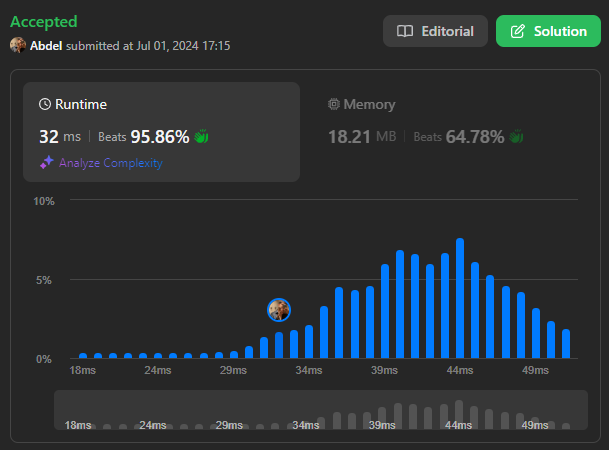

# 98. Validate Binary Search Tree

[View problem on LeetCode](https://leetcode.com/problems/validate-binary-search-tree/)



Time complexity is $O(n)$ because we visit each node once.

Space complexity is $O(n)$ because of the recursion stack.

```
Given the root of a binary tree, determine if it is a valid binary search tree (BST).

A valid BST is defined as follows:

The left
subtree
 of a node contains only nodes with keys less than the node's key.
The right subtree of a node contains only nodes with keys greater than the node's key.
Both the left and right subtrees must also be binary search trees.


Example 1:

Input: root = [2,1,3]
Output: true


Example 2:

Input: root = [5,1,4,null,null,3,6]
Output: false
Explanation: The root node's value is 5 but its right child's value is 4.


Constraints:

The number of nodes in the tree is in the range [1, 10^4].
-2^31 <= Node.val <= 2^31 - 1
```

## Example 1 Visualization


## Example 2 Visualization


