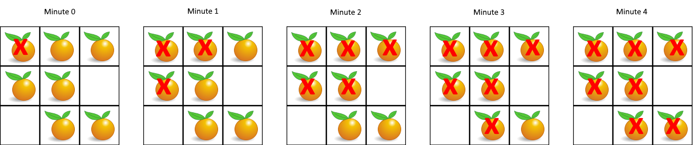

# 994. Rotting Oranges

[View problem on LeetCode](https://leetcode.com/problems/rotting-oranges/)


In this problem, I used Breadth First Search (BFS):

- I first created a queue to store the rotten oranges and a variable to keep track of the number of the fresh oranges, I iterated through the grid to add the initial rotten oranges to the queue and count the fresh oranges.

- Then, I started the BFS process by iterating through the queue and checking the 4-directional neighbors of the current rotten orange while removing it from the queue. If the neighbor is a fresh orange, I added it to the queue and decremented the count of fresh oranges. I also marked the neighbor as rotten by changing its value to 2.

- I repeated the process until the queue was empty. If there were still fresh oranges left, I returned -1; otherwise, I returned the number of minutes that had elapsed.

The time complexity of this solution is $O(m*n)$ where $m$ is the number of rows and $n$ is the number of columns in the grid.

The space complexity is also $O(m*n)$ because the queue can store at most $m*n$ elements.

```
You are given an m x n grid where each cell can have one of three values:

- 0 representing an empty cell,
- 1 representing a fresh orange, or
- 2 representing a rotten orange.

Every minute, any fresh orange that is 4-directionally adjacent to a rotten orange becomes rotten.

Return the minimum number of minutes that must elapse until no cell has a fresh orange. If this is impossible, return -1.


Example 1:

Input: grid = [[2,1,1],[1,1,0],[0,1,1]]
Output: 4


Example 2:

Input: grid = [[2,1,1],[0,1,1],[1,0,1]]
Output: -1
Explanation: The orange in the bottom left corner (row 2, column 0) is never rotten, because rotting only happens 4-directionally.


Example 3:

Input: grid = [[0,2]]
Output: 0
Explanation: Since there are already no fresh oranges at minute 0, the answer is just 0.


Constraints:

m == grid.length
n == grid[i].length
1 <= m, n <= 10
grid[i][j] is 0, 1, or 2.
```

## Example 1 Visualization


