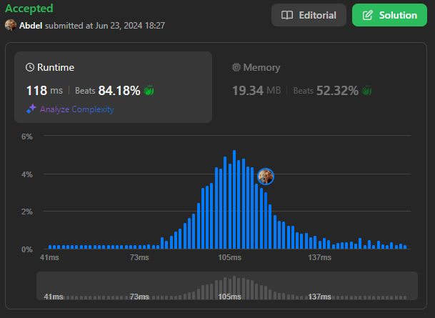

# 135. Candy

[View problem on LeetCode](https://leetcode.com/problems/candy/)



I used a two-pass approach to solve this problem.

The idea is to first assign candies to children based on their ratings from left to right, ensuring that a child with a higher rating gets more candies than their left neighbor.

Then, we adjust the candies from right to left to ensure that a child with a higher rating gets more candies than their right neighbor.

The total number of candies required is the sum of all the candies assigned to the children.

Time complexity is $O(n)$ where $n$ is the length of the `ratings` list.

```
There are n children standing in a line. Each child is assigned a rating value given in the integer array ratings.

You are giving candies to these children subjected to the following requirements:

Each child must have at least one candy.
Children with a higher rating get more candies than their neighbors.
Return the minimum number of candies you need to have to distribute the candies to the children.


Example 1:

Input: ratings = [1,0,2]
Output: 5
Explanation: You can allocate to the first, second and third child with 2, 1, 2 candies respectively.


Example 2:

Input: ratings = [1,2,2]
Output: 4
Explanation: You can allocate to the first, second and third child with 1, 2, 1 candies respectively.
The third child gets 1 candy because it satisfies the above two conditions.


Constraints:

n == ratings.length
1 <= n <= 2 * 10^4
0 <= ratings[i] <= 2 * 10^4
```

## Explanation of the Code written by ChatGPT:

### Problem Understanding:

The goal is to distribute candies to children such that each child has at least one candy, and children with higher ratings get more candies than their neighbors.

### Initialization:

- `n`: The number of children, derived from the length of the `ratings` list.
- `candies`: A list initialized to 1 for each child, since each child must have at least one candy.

### First Pass (Left to Right):

- Iterate through the `ratings` list from the second child to the last child.
- If the current child's rating is higher than the previous child's rating, increment the current child's candy count by 1 more than the previous child's candy count.

### Second Pass (Right to Left):

- Iterate through the `ratings` list from the second-to-last child to the first child.
- If the current child's rating is higher than the next child's rating, ensure the current child has more candies than the next child by taking the maximum of the current candy count and the next child's candy count plus 1.

### Return Result:

- The total number of candies required is the sum of all the values in the `candies` list. Return this sum as the final result.
