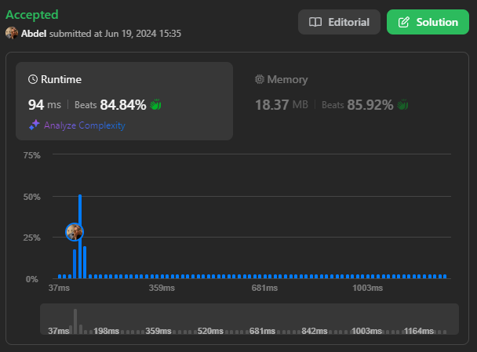
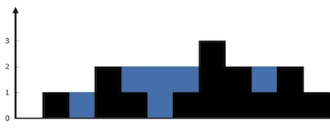

# 42. Trapping Rain Water

[View problem on LeetCode](https://leetcode.com/problems/trapping-rain-water/)



I used a two-pointer approach to solve this problem. The idea is to keep track of the maximum height encountered from the left and right sides while moving towards the center. The trapped water at each position is calculated based on the difference between the current height and the maximum height encountered from the left or right side. The total trapped water is the sum of the trapped water at each position.

Time complexity is $O(n)$ where $n$ is the length of the `height` list.

```
Given n non-negative integers representing an elevation map where the width of each bar is 1, compute how much water it can trap after raining.


Example 1:

Input: height = [0,1,0,2,1,0,1,3,2,1,2,1]
Output: 6
Explanation: The above elevation map (black section) is represented by array [0,1,0,2,1,0,1,3,2,1,2,1]. In this case, 6 units of rain water (blue section) are being trapped.


Example 2:

Input: height = [4,2,0,3,2,5]
Output: 9


Constraints:

n == height.length
1 <= n <= 2 * 104
0 <= height[i] <= 105
```

## Example 1 Visualization



## Explanation of the Code written by ChatGPT:

### Initialization:

- `left`, `right`: Pointers initialized to the start and end of the `height` list, respectively.
- `left_max`, `right_max`: Variables to keep track of the maximum height encountered from the left and right sides, respectively, initialized to 0.
- `water`: Variable to store the total amount of trapped water, initialized to 0.

### Two-Pointer Approach:

- Use a `while` loop to process the `height` list until the `left` pointer is less than the `right` pointer.

### Handling the Left Pointer:

- If the height at the `left` pointer is less than the height at the `right` pointer:
  - If `height[left]` is greater than `left_max`, update `left_max` to `height[left]`.
  - Otherwise, add the difference between `left_max` and `height[left]` to `water` (this difference represents the trapped water at the current position).
  - Increment the `left` pointer to move towards the center.

### Handling the Right Pointer:

- If the height at the `right` pointer is less than or equal to the height at the `left` pointer:
  - If `height[right]` is greater than `right_max`, update `right_max` to `height[right]`.
  - Otherwise, add the difference between `right_max` and `height[right]` to `water` (this difference represents the trapped water at the current position).
  - Decrement the `right` pointer to move towards the center.

### Return Result:

- After the loop completes, `water` contains the total amount of trapped water. Return `water` as the final result.
