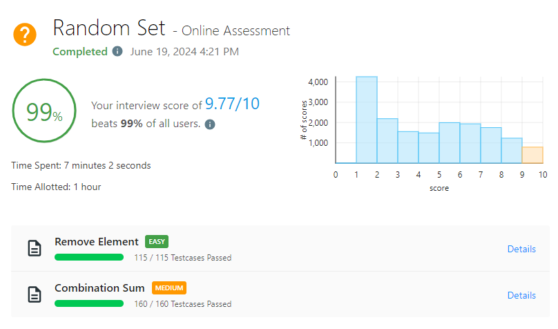

# Random Set - Online Assessment #1

_Passed on June 19, 2024 4:21 PM_



## Remove Element \[EASY\]

Time complexity: $O(n)$ where $n$ is the length of the list

```python
class Solution:
    def removeElement(self, nums: List[int], val: int) -> int:
        nums[:] = [n for n in nums if n != val]
        return len(nums)
```

## Combination Sum \[MEDIUM\]

Time complexity: $O(2^n)$ where $n$ is the number of candidates

```python
class Solution:
    def combinationSum(self, candidates: List[int], target: int) -> List[List[int]]:
        def backtrack(start: int, current: List[int], remaining_target: int) -> None:
            if not remaining_target:
                ans.append(list(current))
                return

            n = len(candidates)
            for i in range(start, n):
                if candidates[i] > remaining_target:
                    break
                current.append(candidates[i])
                backtrack(i, current, remaining_target - candidates[i])
                current.pop()

        candidates.sort()
        ans = []
        backtrack(0, [], target)

        return ans
```
