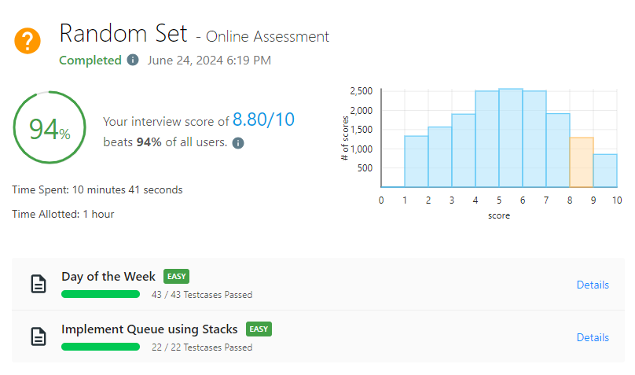

# Random Set - Online Assessment #2

_Passed on June 24, 2024 6:19 PM_



## Day of the Week \[EASY\]

Time complexity: $O(1)$

```python
from datetime import datetime

class Solution:
    def dayOfTheWeek(self, day: int, month: int, year: int) -> str:
        days = ["Monday", "Tuesday", "Wednesday", "Thursday", "Friday", "Saturday", "Sunday"]
        day = datetime(year, month, day)
        return days[day.weekday()]
```

## Implement Queue using Stacks \[EASY\]

```python
class MyQueue:

    def __init__(self):
        self.in_stack = []
        self.out_stack = []

    def push(self, x: int) -> None:
        self.in_stack.append(x)

    def pop(self) -> int:
        self.move()
        return self.out_stack.pop()

    def peek(self) -> int:
        self.move()
        return self.out_stack[-1]

    def empty(self) -> bool:
        return not self.in_stack and not self.out_stack

    def move(self) -> None:
        if not self.out_stack:
            while self.in_stack:
                self.out_stack.append(self.in_stack.pop())


# Your MyQueue object will be instantiated and called as such:
# obj = MyQueue()
# obj.push(x)
# param_2 = obj.pop()
# param_3 = obj.peek()
# param_4 = obj.empty()
```
