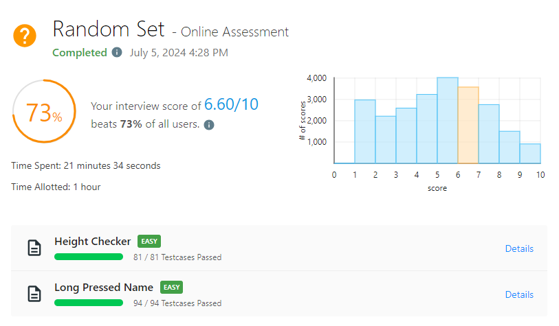

# Random Set - Online Assessment #3

_Passed on July 5, 2024 4:28 PM_



## Height Checker \[EASY\]

Time complexity: $O(n \log n)$

```python
class Solution:
    def heightChecker(self, heights: List[int]) -> int:
        expected = heights.copy()
        expected.sort()
        n, a = len(heights), 0
        for i in range(n):
            if expected[i] != heights[i]:
                a += 1
        return a
```

## Long Pressed Name \[EASY\]

Time complexity: $O(n)$

```python
class Solution:
    def isLongPressedName(self, name: str, typed: str) -> bool:
        i, j = 0, 0
        while j < len(typed):
            if i < len(name) and name[i] == typed[j]:
                i += 1
                j += 1
            elif j > 0 and typed[j - 1] == typed[j]:
                j += 1
            else:
                return False
        return i == len(name)
```
