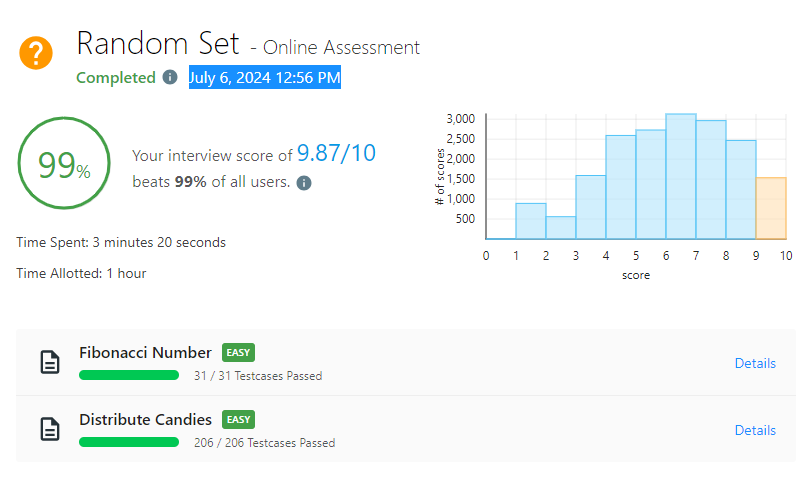

# Random Set - Online Assessment #4

_Passed on July 6, 2024 12:56 PM_



## Fibonacci Number \[EASY\]

Time complexity: $O(2^n)$

```python
class Solution:
    def fib(self, n: int) -> int:
        if n <= 1:
            return n
        return self.fib(n - 1) + self.fib(n - 2)
```

## Distribute Candies \[EASY\]

Time complexity: $O(n)$

```python
class Solution:
    def distributeCandies(self, candyType: List[int]) -> int:
        hset = set(candyType)
        na, ns = len(candyType), len(hset)
        return ns if ns < na // 2 else na // 2
```
